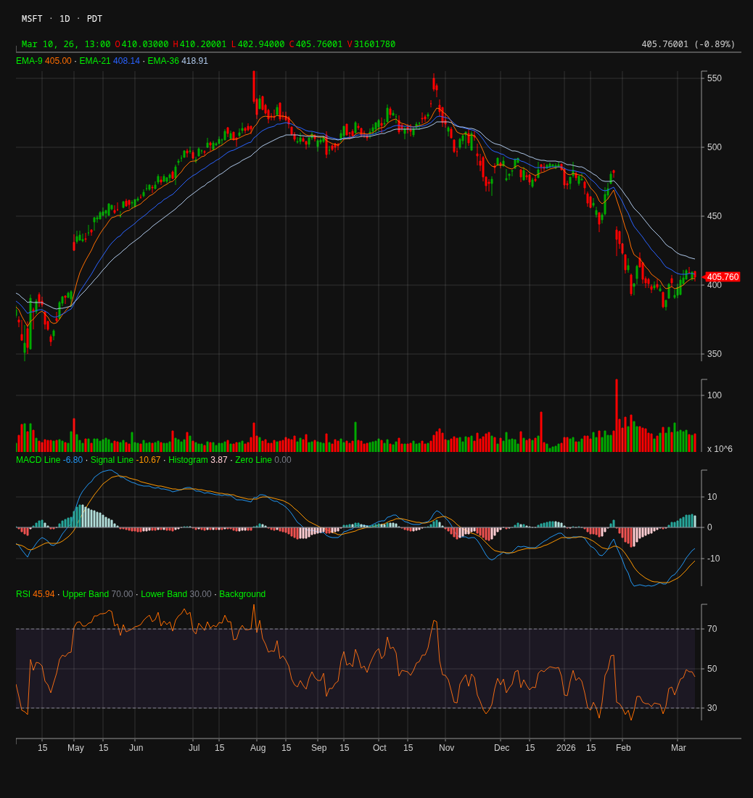

# MCP Stock Chart Server

A Model Context Protocol (MCP) server that provides AI agents (like OpenClaw, Claude Desktop, Cursor) with the ability to generate beautiful stock and crypto technical analysis charts.

## Capabilities

- `generate_stock_chart`: Generates a technical analysis candlestick chart for a given ticker (e.g., MSFT, AAPL).

## Usage with OpenClaw

You can easily use this tool with OpenClaw or any other MCP-compatible client. 

If you have installed this package globally via npm:

```bash
npx -y mcp-stock-chart
```

You can add it to your OpenClaw or AI Agent's MCP configuration JSON:
```json
{
  "mcpServers": {
    "stock-chart": {
      "command": "npx",
      "args": ["-y", "mcp-stock-chart"]
    }
  }
}
```

## Example


